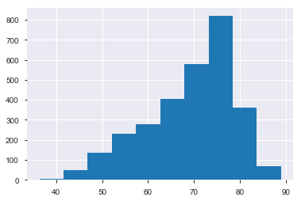
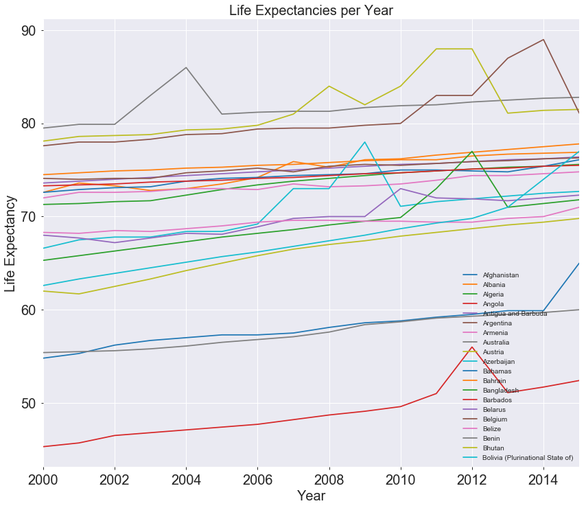
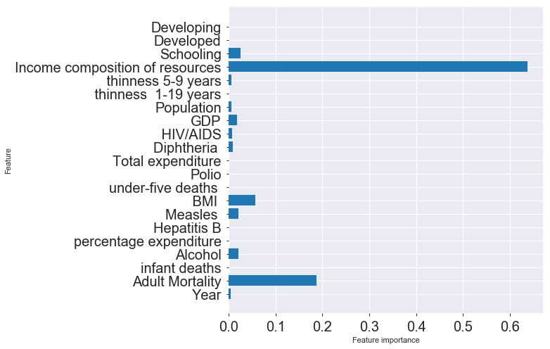
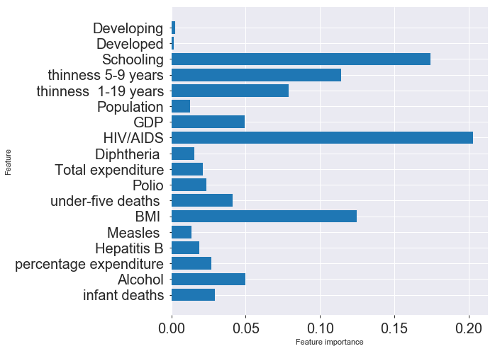

# Mod 5 Project: Classifying Life Expectancy 
## (World Health Organization Data)

**Group Partners: Filis, Manisha, Pablo**

___

Ran the following commands in terminal to install Profiling (visualizing data), and Altair (map):

```
conda install -c conda-forge altair vega_datasets notebook vega
```

```
conda install -c anaconda pandas-profiling
```

## Import libraries


```python
#Data Manipulation
import pandas as pd  
import numpy as np

# #Making Map Visualizations
# import altair as alt
# alt.renderers.enable('notebook')
# from vega_datasets import data

# #Making Line Plot Visualizations
# import plotly.plotly as py 
# import cufflinks as cf 
# from plotly.offline import download_plotlyjs, init_notebook_mode, plot, iplot 
# init_notebook_mode(connected=True) 
# cf.go_offline()

#Displaying EDA Profile
import pandas_profiling

#Disabling warnings 
import warnings
warnings.filterwarnings('ignore')

# Classifiers
from sklearn.ensemble import BaggingClassifier, RandomForestClassifier
from random import randint
from sklearn.model_selection import train_test_split
from sklearn.tree import DecisionTreeClassifier 
from sklearn import tree 
from sklearn import svm

# Measuring models and feature importance
from sklearn import metrics
from sklearn.metrics import accuracy_score, confusion_matrix, classification_report, roc_curve, auc
import matplotlib.pyplot as plt
%matplotlib inline

# sklearn processing stuff
from sklearn.model_selection import GridSearchCV
from sklearn.pipeline import make_pipeline
from sklearn.model_selection import cross_validate, cross_val_score, cross_val_predict
from sklearn import preprocessing
```

## Read in csv and display first five rows


```python
df = pd.read_csv('Life Expectancy Data.csv')
df.head()
```


<div>
<style scoped>
    .dataframe tbody tr th:only-of-type {
        vertical-align: middle;
    }

    .dataframe tbody tr th {
        vertical-align: top;
    }

    .dataframe thead th {
        text-align: right;
    }
</style>
<table border="1" class="dataframe">
  <thead>
    <tr style="text-align: right;">
      <th></th>
      <th>Country</th>
      <th>Year</th>
      <th>Status</th>
      <th>Life expectancy</th>
      <th>Adult Mortality</th>
      <th>infant deaths</th>
      <th>Alcohol</th>
      <th>percentage expenditure</th>
      <th>Hepatitis B</th>
      <th>Measles</th>
      <th>...</th>
      <th>Polio</th>
      <th>Total expenditure</th>
      <th>Diphtheria</th>
      <th>HIV/AIDS</th>
      <th>GDP</th>
      <th>Population</th>
      <th>thinness  1-19 years</th>
      <th>thinness 5-9 years</th>
      <th>Income composition of resources</th>
      <th>Schooling</th>
    </tr>
  </thead>
  <tbody>
    <tr>
      <th>0</th>
      <td>Afghanistan</td>
      <td>2015</td>
      <td>Developing</td>
      <td>65.0</td>
      <td>263.0</td>
      <td>62</td>
      <td>0.01</td>
      <td>71.279624</td>
      <td>65.0</td>
      <td>1154</td>
      <td>...</td>
      <td>6.0</td>
      <td>8.16</td>
      <td>65.0</td>
      <td>0.1</td>
      <td>584.259210</td>
      <td>33736494.0</td>
      <td>17.2</td>
      <td>17.3</td>
      <td>0.479</td>
      <td>10.1</td>
    </tr>
    <tr>
      <th>1</th>
      <td>Afghanistan</td>
      <td>2014</td>
      <td>Developing</td>
      <td>59.9</td>
      <td>271.0</td>
      <td>64</td>
      <td>0.01</td>
      <td>73.523582</td>
      <td>62.0</td>
      <td>492</td>
      <td>...</td>
      <td>58.0</td>
      <td>8.18</td>
      <td>62.0</td>
      <td>0.1</td>
      <td>612.696514</td>
      <td>327582.0</td>
      <td>17.5</td>
      <td>17.5</td>
      <td>0.476</td>
      <td>10.0</td>
    </tr>
    <tr>
      <th>2</th>
      <td>Afghanistan</td>
      <td>2013</td>
      <td>Developing</td>
      <td>59.9</td>
      <td>268.0</td>
      <td>66</td>
      <td>0.01</td>
      <td>73.219243</td>
      <td>64.0</td>
      <td>430</td>
      <td>...</td>
      <td>62.0</td>
      <td>8.13</td>
      <td>64.0</td>
      <td>0.1</td>
      <td>631.744976</td>
      <td>31731688.0</td>
      <td>17.7</td>
      <td>17.7</td>
      <td>0.470</td>
      <td>9.9</td>
    </tr>
    <tr>
      <th>3</th>
      <td>Afghanistan</td>
      <td>2012</td>
      <td>Developing</td>
      <td>59.5</td>
      <td>272.0</td>
      <td>69</td>
      <td>0.01</td>
      <td>78.184215</td>
      <td>67.0</td>
      <td>2787</td>
      <td>...</td>
      <td>67.0</td>
      <td>8.52</td>
      <td>67.0</td>
      <td>0.1</td>
      <td>669.959000</td>
      <td>3696958.0</td>
      <td>17.9</td>
      <td>18.0</td>
      <td>0.463</td>
      <td>9.8</td>
    </tr>
    <tr>
      <th>4</th>
      <td>Afghanistan</td>
      <td>2011</td>
      <td>Developing</td>
      <td>59.2</td>
      <td>275.0</td>
      <td>71</td>
      <td>0.01</td>
      <td>7.097109</td>
      <td>68.0</td>
      <td>3013</td>
      <td>...</td>
      <td>68.0</td>
      <td>7.87</td>
      <td>68.0</td>
      <td>0.1</td>
      <td>63.537231</td>
      <td>2978599.0</td>
      <td>18.2</td>
      <td>18.2</td>
      <td>0.454</td>
      <td>9.5</td>
    </tr>
  </tbody>
</table>
<p>5 rows × 22 columns</p>
</div>


## Dimensions of dataset 


```python
df.shape
```


    (2938, 22)


## Check for NaN's in out entire dataset


```python
df.isna().sum().sort_values(ascending=False)
```


    Population                         652
    Hepatitis B                        553
    GDP                                448
    Total expenditure                  226
    Alcohol                            194
    Income composition of resources    167
    Schooling                          163
     BMI                                34
     thinness  1-19 years               34
     thinness 5-9 years                 34
    Diphtheria                          19
    Polio                               19
    Adult Mortality                     10
    Life expectancy                     10
    under-five deaths                    0
     HIV/AIDS                            0
    Measles                              0
    percentage expenditure               0
    infant deaths                        0
    Status                               0
    Year                                 0
    Country                              0
    dtype: int64


## Visualizing the distribution of our potential target variable, life expectancy


```python
df['Life expectancy '].hist()
```


    <matplotlib.axes._subplots.AxesSubplot at 0x1a1efad7b8>





## Seeing any trend of the life expectancies with respect to years


```python
# #This plot of life expectancies is of one country with respect to years. 
# df_group.loc['Albania'].iplot(y='Life expectancy ')
# print('Albania')

```


```python
df_group = df.set_index(['Country', 'Year'])
plt.rc('xtick',labelsize=20)
plt.rc('ytick',labelsize=20)
countries = df['Country'].unique()
fig = plt.figure(figsize=(14,12))
ax = fig.add_subplot(111)
plt.ylabel('Life Expectancy', fontsize=20)
plt.xlabel('Years', fontsize=20)
plt.title('Life Expectancies per Year', fontsize=20)

for country in countries[:20]:
    df_group.loc[country].plot(y='Life expectancy ', ax=ax)
L = plt.legend(countries[:20])

plt.savefig('Life Expectacies per Year.png')
```





#### Finding: Most countries appear relatively flat, indicating a small correlation with time dependence. We investigate this more below. 

## Using profiling to speed up exporatory data analysis (EDA)


```python
# profile = pandas_profiling.ProfileReport(df)
```


```python
# from IPython.core.display import display, HTML
# display(HTML(profile.html))

```

## Displaying the columns in our dataset


```python
df.columns
```


    Index(['Country', 'Year', 'Status', 'Life expectancy ', 'Adult Mortality',
           'infant deaths', 'Alcohol', 'percentage expenditure', 'Hepatitis B',
           'Measles ', ' BMI ', 'under-five deaths ', 'Polio', 'Total expenditure',
           'Diphtheria ', ' HIV/AIDS', 'GDP', 'Population',
           ' thinness  1-19 years', ' thinness 5-9 years',
           'Income composition of resources', 'Schooling'],
          dtype='object')


## Column descriptions

`Status`
Developed or Developing status

`Life expectancy` 
Life Expectancy in age

`Adult Mortality`
Adult Mortality Rates of both sexes (probability of dying between 15 and 60 years per 1000 population)

`infant deaths`
Number of Infant Deaths per 1000 population

`Alcohol`
Alcohol, recorded per capita (15+) consumption (in litres of pure alcohol)

`percentage expenditure`
Expenditure on health as a percentage of Gross Domestic Product per capita(%)

`Hepatitis B`
Hepatitis B (HepB) immunization coverage among 1-year-olds (%)

`Measles` 
Measles - number of reported cases per 1000 population

`BMI` 
Average Body Mass Index of entire population

`under-five deaths` 
Number of under-five deaths per 1000 population

`Polio`
Polio (Pol3) immunization coverage among 1-year-olds (%)

`Total expenditure`
General government expenditure on health as a percentage of total government expenditure (%)

`Diphtheria` 
Diphtheria tetanus toxoid and pertussis (DTP3) immunization coverage among 1-year-olds (%)

`HIV/AIDS`
Deaths per 1 000 live births HIV/AIDS (0-4 years)

`GDP`
Gross Domestic Product per capita (in USD)

`Population`
Population of the country

`thinness 1-19 years`
Prevalence of thinness among children and adolescents for Age 10 to 19 (% )

`thinness 5-9 years`
Prevalence of thinness among children for Age 5 to 9(%)

`Income composition of resources`
Human Development Index in terms of income composition of resources (index ranging from 0 to 1) url: http://hdr.undp.org/en/content/human-development-index-hdi

`Schooling`
Number of years of Schooling(years)


```python
df.corr()[1:2]
```


<div>
<style scoped>
    .dataframe tbody tr th:only-of-type {
        vertical-align: middle;
    }

    .dataframe tbody tr th {
        vertical-align: top;
    }

    .dataframe thead th {
        text-align: right;
    }
</style>
<table border="1" class="dataframe">
  <thead>
    <tr style="text-align: right;">
      <th></th>
      <th>Year</th>
      <th>Life expectancy</th>
      <th>Adult Mortality</th>
      <th>infant deaths</th>
      <th>Alcohol</th>
      <th>percentage expenditure</th>
      <th>Hepatitis B</th>
      <th>Measles</th>
      <th>BMI</th>
      <th>under-five deaths</th>
      <th>Polio</th>
      <th>Total expenditure</th>
      <th>Diphtheria</th>
      <th>HIV/AIDS</th>
      <th>GDP</th>
      <th>Population</th>
      <th>thinness  1-19 years</th>
      <th>thinness 5-9 years</th>
      <th>Income composition of resources</th>
      <th>Schooling</th>
    </tr>
  </thead>
  <tbody>
    <tr>
      <th>Life expectancy</th>
      <td>0.170033</td>
      <td>1.0</td>
      <td>-0.696359</td>
      <td>-0.196557</td>
      <td>0.404877</td>
      <td>0.381864</td>
      <td>0.256762</td>
      <td>-0.157586</td>
      <td>0.567694</td>
      <td>-0.222529</td>
      <td>0.465556</td>
      <td>0.218086</td>
      <td>0.479495</td>
      <td>-0.556556</td>
      <td>0.461455</td>
      <td>-0.021538</td>
      <td>-0.477183</td>
      <td>-0.471584</td>
      <td>0.724776</td>
      <td>0.751975</td>
    </tr>
  </tbody>
</table>
</div>


## Visualizing the global life expectancy for 2015 using Altair mapping


```python
print('Maximum year is', df['Year'].max())
print('Minimum year is', df['Year'].min())

```

    Maximum year is 2015
    Minimum year is 2000


Let's filter by 2015 to make a map of life expectency per country. 


```python
df_2015 = df[df['Year']==2015]
```

Reading in the country codes tsv to make the map (file generated from UN stats webpage: 
https://unstats.un.org/unsd/methodology/m49/  


```python
country_codes = pd.read_csv('country_code_2.tsv',sep='\t')
country_codes.head()
```


<div>
<style scoped>
    .dataframe tbody tr th:only-of-type {
        vertical-align: middle;
    }

    .dataframe tbody tr th {
        vertical-align: top;
    }

    .dataframe thead th {
        text-align: right;
    }
</style>
<table border="1" class="dataframe">
  <thead>
    <tr style="text-align: right;">
      <th></th>
      <th>Country or Area</th>
      <th>M49 code</th>
      <th>ISO-alpha3 code</th>
    </tr>
  </thead>
  <tbody>
    <tr>
      <th>0</th>
      <td>Afghanistan</td>
      <td>4</td>
      <td>AFG</td>
    </tr>
    <tr>
      <th>1</th>
      <td>Aland Islands</td>
      <td>248</td>
      <td>ALA</td>
    </tr>
    <tr>
      <th>2</th>
      <td>Albania</td>
      <td>8</td>
      <td>ALB</td>
    </tr>
    <tr>
      <th>3</th>
      <td>Algeria</td>
      <td>12</td>
      <td>DZA</td>
    </tr>
    <tr>
      <th>4</th>
      <td>American Samoa</td>
      <td>16</td>
      <td>ASM</td>
    </tr>
  </tbody>
</table>
</div>


 Matching countries to country names in country codes tsv data


```python
df_2015.replace("Côte d'Ivoire", "Cote d'Ivoire", inplace=True)
df_2015.replace('Swaziland', 'Eswatini', inplace=True)
df_2015.replace('The former Yugoslav republic of Macedonia', 'North Macedonia', inplace=True)

df_2015_map = df_2015.merge(country_codes, how="left", left_on="Country",right_on="Country or Area")
df_2015_map.rename(columns={'M49 code': 'id'}, inplace=True)
df_2015_map.drop(columns=['ISO-alpha3 code', 'Country or Area'], inplace=True)

df_2015_map['tooltip']=df_2015_map['Country']+': '+df_2015_map['Life expectancy '].astype(str) + ' yr'
```

### Making the map!


```python
# source = alt.topo_feature(data.world_110m.url,'countries')

# map_plot = alt.Chart(source).mark_geoshape().encode(
#     color=alt.Color('Life expectancy :Q', legend=alt.Legend(title='Years')),
#     tooltip='tooltip:N'
# ).transform_lookup(
#    lookup='id',
#    from_=alt.LookupData(df_2015_map, 'id', ['Life expectancy ', 'tooltip'])
# ).project(
#    type='equirectangular'
# ).properties(
#     width=900,
#     height=540,
#     title=('Life Expectency in Years')
# )

```


```python
# map_plot
```

#### Finding: The country with the highest life-expectancy is Slovenia (Europe) at 88 years, and the lowest is Sierra Leonne (Africa) at 52 years. 


```python
df_group = df.set_index(['Country','Year'])
df_group.head()
```


<div>
<style scoped>
    .dataframe tbody tr th:only-of-type {
        vertical-align: middle;
    }

    .dataframe tbody tr th {
        vertical-align: top;
    }

    .dataframe thead th {
        text-align: right;
    }
</style>
<table border="1" class="dataframe">
  <thead>
    <tr style="text-align: right;">
      <th></th>
      <th></th>
      <th>Status</th>
      <th>Life expectancy</th>
      <th>Adult Mortality</th>
      <th>infant deaths</th>
      <th>Alcohol</th>
      <th>percentage expenditure</th>
      <th>Hepatitis B</th>
      <th>Measles</th>
      <th>BMI</th>
      <th>under-five deaths</th>
      <th>Polio</th>
      <th>Total expenditure</th>
      <th>Diphtheria</th>
      <th>HIV/AIDS</th>
      <th>GDP</th>
      <th>Population</th>
      <th>thinness  1-19 years</th>
      <th>thinness 5-9 years</th>
      <th>Income composition of resources</th>
      <th>Schooling</th>
    </tr>
    <tr>
      <th>Country</th>
      <th>Year</th>
      <th></th>
      <th></th>
      <th></th>
      <th></th>
      <th></th>
      <th></th>
      <th></th>
      <th></th>
      <th></th>
      <th></th>
      <th></th>
      <th></th>
      <th></th>
      <th></th>
      <th></th>
      <th></th>
      <th></th>
      <th></th>
      <th></th>
      <th></th>
    </tr>
  </thead>
  <tbody>
    <tr>
      <th rowspan="5" valign="top">Afghanistan</th>
      <th>2015</th>
      <td>Developing</td>
      <td>65.0</td>
      <td>263.0</td>
      <td>62</td>
      <td>0.01</td>
      <td>71.279624</td>
      <td>65.0</td>
      <td>1154</td>
      <td>19.1</td>
      <td>83</td>
      <td>6.0</td>
      <td>8.16</td>
      <td>65.0</td>
      <td>0.1</td>
      <td>584.259210</td>
      <td>33736494.0</td>
      <td>17.2</td>
      <td>17.3</td>
      <td>0.479</td>
      <td>10.1</td>
    </tr>
    <tr>
      <th>2014</th>
      <td>Developing</td>
      <td>59.9</td>
      <td>271.0</td>
      <td>64</td>
      <td>0.01</td>
      <td>73.523582</td>
      <td>62.0</td>
      <td>492</td>
      <td>18.6</td>
      <td>86</td>
      <td>58.0</td>
      <td>8.18</td>
      <td>62.0</td>
      <td>0.1</td>
      <td>612.696514</td>
      <td>327582.0</td>
      <td>17.5</td>
      <td>17.5</td>
      <td>0.476</td>
      <td>10.0</td>
    </tr>
    <tr>
      <th>2013</th>
      <td>Developing</td>
      <td>59.9</td>
      <td>268.0</td>
      <td>66</td>
      <td>0.01</td>
      <td>73.219243</td>
      <td>64.0</td>
      <td>430</td>
      <td>18.1</td>
      <td>89</td>
      <td>62.0</td>
      <td>8.13</td>
      <td>64.0</td>
      <td>0.1</td>
      <td>631.744976</td>
      <td>31731688.0</td>
      <td>17.7</td>
      <td>17.7</td>
      <td>0.470</td>
      <td>9.9</td>
    </tr>
    <tr>
      <th>2012</th>
      <td>Developing</td>
      <td>59.5</td>
      <td>272.0</td>
      <td>69</td>
      <td>0.01</td>
      <td>78.184215</td>
      <td>67.0</td>
      <td>2787</td>
      <td>17.6</td>
      <td>93</td>
      <td>67.0</td>
      <td>8.52</td>
      <td>67.0</td>
      <td>0.1</td>
      <td>669.959000</td>
      <td>3696958.0</td>
      <td>17.9</td>
      <td>18.0</td>
      <td>0.463</td>
      <td>9.8</td>
    </tr>
    <tr>
      <th>2011</th>
      <td>Developing</td>
      <td>59.2</td>
      <td>275.0</td>
      <td>71</td>
      <td>0.01</td>
      <td>7.097109</td>
      <td>68.0</td>
      <td>3013</td>
      <td>17.2</td>
      <td>97</td>
      <td>68.0</td>
      <td>7.87</td>
      <td>68.0</td>
      <td>0.1</td>
      <td>63.537231</td>
      <td>2978599.0</td>
      <td>18.2</td>
      <td>18.2</td>
      <td>0.454</td>
      <td>9.5</td>
    </tr>
  </tbody>
</table>
</div>


## Drop all NaN's and check remaining length of dataframe


```python
df_nona = df.dropna()
```


```python
df_nona.shape
```


    (1649, 22)


## Rename "Life expectancy" column as "target"


```python
df_nona.head()
```


<div>
<style scoped>
    .dataframe tbody tr th:only-of-type {
        vertical-align: middle;
    }

    .dataframe tbody tr th {
        vertical-align: top;
    }

    .dataframe thead th {
        text-align: right;
    }
</style>
<table border="1" class="dataframe">
  <thead>
    <tr style="text-align: right;">
      <th></th>
      <th>Country</th>
      <th>Year</th>
      <th>Status</th>
      <th>Life expectancy</th>
      <th>Adult Mortality</th>
      <th>infant deaths</th>
      <th>Alcohol</th>
      <th>percentage expenditure</th>
      <th>Hepatitis B</th>
      <th>Measles</th>
      <th>...</th>
      <th>Polio</th>
      <th>Total expenditure</th>
      <th>Diphtheria</th>
      <th>HIV/AIDS</th>
      <th>GDP</th>
      <th>Population</th>
      <th>thinness  1-19 years</th>
      <th>thinness 5-9 years</th>
      <th>Income composition of resources</th>
      <th>Schooling</th>
    </tr>
  </thead>
  <tbody>
    <tr>
      <th>0</th>
      <td>Afghanistan</td>
      <td>2015</td>
      <td>Developing</td>
      <td>65.0</td>
      <td>263.0</td>
      <td>62</td>
      <td>0.01</td>
      <td>71.279624</td>
      <td>65.0</td>
      <td>1154</td>
      <td>...</td>
      <td>6.0</td>
      <td>8.16</td>
      <td>65.0</td>
      <td>0.1</td>
      <td>584.259210</td>
      <td>33736494.0</td>
      <td>17.2</td>
      <td>17.3</td>
      <td>0.479</td>
      <td>10.1</td>
    </tr>
    <tr>
      <th>1</th>
      <td>Afghanistan</td>
      <td>2014</td>
      <td>Developing</td>
      <td>59.9</td>
      <td>271.0</td>
      <td>64</td>
      <td>0.01</td>
      <td>73.523582</td>
      <td>62.0</td>
      <td>492</td>
      <td>...</td>
      <td>58.0</td>
      <td>8.18</td>
      <td>62.0</td>
      <td>0.1</td>
      <td>612.696514</td>
      <td>327582.0</td>
      <td>17.5</td>
      <td>17.5</td>
      <td>0.476</td>
      <td>10.0</td>
    </tr>
    <tr>
      <th>2</th>
      <td>Afghanistan</td>
      <td>2013</td>
      <td>Developing</td>
      <td>59.9</td>
      <td>268.0</td>
      <td>66</td>
      <td>0.01</td>
      <td>73.219243</td>
      <td>64.0</td>
      <td>430</td>
      <td>...</td>
      <td>62.0</td>
      <td>8.13</td>
      <td>64.0</td>
      <td>0.1</td>
      <td>631.744976</td>
      <td>31731688.0</td>
      <td>17.7</td>
      <td>17.7</td>
      <td>0.470</td>
      <td>9.9</td>
    </tr>
    <tr>
      <th>3</th>
      <td>Afghanistan</td>
      <td>2012</td>
      <td>Developing</td>
      <td>59.5</td>
      <td>272.0</td>
      <td>69</td>
      <td>0.01</td>
      <td>78.184215</td>
      <td>67.0</td>
      <td>2787</td>
      <td>...</td>
      <td>67.0</td>
      <td>8.52</td>
      <td>67.0</td>
      <td>0.1</td>
      <td>669.959000</td>
      <td>3696958.0</td>
      <td>17.9</td>
      <td>18.0</td>
      <td>0.463</td>
      <td>9.8</td>
    </tr>
    <tr>
      <th>4</th>
      <td>Afghanistan</td>
      <td>2011</td>
      <td>Developing</td>
      <td>59.2</td>
      <td>275.0</td>
      <td>71</td>
      <td>0.01</td>
      <td>7.097109</td>
      <td>68.0</td>
      <td>3013</td>
      <td>...</td>
      <td>68.0</td>
      <td>7.87</td>
      <td>68.0</td>
      <td>0.1</td>
      <td>63.537231</td>
      <td>2978599.0</td>
      <td>18.2</td>
      <td>18.2</td>
      <td>0.454</td>
      <td>9.5</td>
    </tr>
  </tbody>
</table>
<p>5 rows × 22 columns</p>
</div>


```python
df_nona.rename(columns={'Life expectancy ':'target'}, inplace=True)
```


```python
df_nona.head()
```


<div>
<style scoped>
    .dataframe tbody tr th:only-of-type {
        vertical-align: middle;
    }

    .dataframe tbody tr th {
        vertical-align: top;
    }

    .dataframe thead th {
        text-align: right;
    }
</style>
<table border="1" class="dataframe">
  <thead>
    <tr style="text-align: right;">
      <th></th>
      <th>Country</th>
      <th>Year</th>
      <th>Status</th>
      <th>target</th>
      <th>Adult Mortality</th>
      <th>infant deaths</th>
      <th>Alcohol</th>
      <th>percentage expenditure</th>
      <th>Hepatitis B</th>
      <th>Measles</th>
      <th>...</th>
      <th>Polio</th>
      <th>Total expenditure</th>
      <th>Diphtheria</th>
      <th>HIV/AIDS</th>
      <th>GDP</th>
      <th>Population</th>
      <th>thinness  1-19 years</th>
      <th>thinness 5-9 years</th>
      <th>Income composition of resources</th>
      <th>Schooling</th>
    </tr>
  </thead>
  <tbody>
    <tr>
      <th>0</th>
      <td>Afghanistan</td>
      <td>2015</td>
      <td>Developing</td>
      <td>65.0</td>
      <td>263.0</td>
      <td>62</td>
      <td>0.01</td>
      <td>71.279624</td>
      <td>65.0</td>
      <td>1154</td>
      <td>...</td>
      <td>6.0</td>
      <td>8.16</td>
      <td>65.0</td>
      <td>0.1</td>
      <td>584.259210</td>
      <td>33736494.0</td>
      <td>17.2</td>
      <td>17.3</td>
      <td>0.479</td>
      <td>10.1</td>
    </tr>
    <tr>
      <th>1</th>
      <td>Afghanistan</td>
      <td>2014</td>
      <td>Developing</td>
      <td>59.9</td>
      <td>271.0</td>
      <td>64</td>
      <td>0.01</td>
      <td>73.523582</td>
      <td>62.0</td>
      <td>492</td>
      <td>...</td>
      <td>58.0</td>
      <td>8.18</td>
      <td>62.0</td>
      <td>0.1</td>
      <td>612.696514</td>
      <td>327582.0</td>
      <td>17.5</td>
      <td>17.5</td>
      <td>0.476</td>
      <td>10.0</td>
    </tr>
    <tr>
      <th>2</th>
      <td>Afghanistan</td>
      <td>2013</td>
      <td>Developing</td>
      <td>59.9</td>
      <td>268.0</td>
      <td>66</td>
      <td>0.01</td>
      <td>73.219243</td>
      <td>64.0</td>
      <td>430</td>
      <td>...</td>
      <td>62.0</td>
      <td>8.13</td>
      <td>64.0</td>
      <td>0.1</td>
      <td>631.744976</td>
      <td>31731688.0</td>
      <td>17.7</td>
      <td>17.7</td>
      <td>0.470</td>
      <td>9.9</td>
    </tr>
    <tr>
      <th>3</th>
      <td>Afghanistan</td>
      <td>2012</td>
      <td>Developing</td>
      <td>59.5</td>
      <td>272.0</td>
      <td>69</td>
      <td>0.01</td>
      <td>78.184215</td>
      <td>67.0</td>
      <td>2787</td>
      <td>...</td>
      <td>67.0</td>
      <td>8.52</td>
      <td>67.0</td>
      <td>0.1</td>
      <td>669.959000</td>
      <td>3696958.0</td>
      <td>17.9</td>
      <td>18.0</td>
      <td>0.463</td>
      <td>9.8</td>
    </tr>
    <tr>
      <th>4</th>
      <td>Afghanistan</td>
      <td>2011</td>
      <td>Developing</td>
      <td>59.2</td>
      <td>275.0</td>
      <td>71</td>
      <td>0.01</td>
      <td>7.097109</td>
      <td>68.0</td>
      <td>3013</td>
      <td>...</td>
      <td>68.0</td>
      <td>7.87</td>
      <td>68.0</td>
      <td>0.1</td>
      <td>63.537231</td>
      <td>2978599.0</td>
      <td>18.2</td>
      <td>18.2</td>
      <td>0.454</td>
      <td>9.5</td>
    </tr>
  </tbody>
</table>
<p>5 rows × 22 columns</p>
</div>


## Spliting the data at the median value, and anything a above that age will be 1 for long life expectancy and 0 for low life expectancy. 


```python
df_nona['target'].describe()
```


    count    1649.000000
    mean       69.302304
    std         8.796834
    min        44.000000
    25%        64.400000
    50%        71.700000
    75%        75.000000
    max        89.000000
    Name: target, dtype: float64


```python
median_age = np.median(df_nona['target'])
df_nona['target'] = df_nona.target.apply(lambda x: 1 if x >= median_age  else 0)
```


```python
df_nona.target.value_counts()
```


    1    828
    0    821
    Name: target, dtype: int64


```python
df_nona.head()
```


<div>
<style scoped>
    .dataframe tbody tr th:only-of-type {
        vertical-align: middle;
    }

    .dataframe tbody tr th {
        vertical-align: top;
    }

    .dataframe thead th {
        text-align: right;
    }
</style>
<table border="1" class="dataframe">
  <thead>
    <tr style="text-align: right;">
      <th></th>
      <th>Country</th>
      <th>Year</th>
      <th>Status</th>
      <th>target</th>
      <th>Adult Mortality</th>
      <th>infant deaths</th>
      <th>Alcohol</th>
      <th>percentage expenditure</th>
      <th>Hepatitis B</th>
      <th>Measles</th>
      <th>...</th>
      <th>Polio</th>
      <th>Total expenditure</th>
      <th>Diphtheria</th>
      <th>HIV/AIDS</th>
      <th>GDP</th>
      <th>Population</th>
      <th>thinness  1-19 years</th>
      <th>thinness 5-9 years</th>
      <th>Income composition of resources</th>
      <th>Schooling</th>
    </tr>
  </thead>
  <tbody>
    <tr>
      <th>0</th>
      <td>Afghanistan</td>
      <td>2015</td>
      <td>Developing</td>
      <td>0</td>
      <td>263.0</td>
      <td>62</td>
      <td>0.01</td>
      <td>71.279624</td>
      <td>65.0</td>
      <td>1154</td>
      <td>...</td>
      <td>6.0</td>
      <td>8.16</td>
      <td>65.0</td>
      <td>0.1</td>
      <td>584.259210</td>
      <td>33736494.0</td>
      <td>17.2</td>
      <td>17.3</td>
      <td>0.479</td>
      <td>10.1</td>
    </tr>
    <tr>
      <th>1</th>
      <td>Afghanistan</td>
      <td>2014</td>
      <td>Developing</td>
      <td>0</td>
      <td>271.0</td>
      <td>64</td>
      <td>0.01</td>
      <td>73.523582</td>
      <td>62.0</td>
      <td>492</td>
      <td>...</td>
      <td>58.0</td>
      <td>8.18</td>
      <td>62.0</td>
      <td>0.1</td>
      <td>612.696514</td>
      <td>327582.0</td>
      <td>17.5</td>
      <td>17.5</td>
      <td>0.476</td>
      <td>10.0</td>
    </tr>
    <tr>
      <th>2</th>
      <td>Afghanistan</td>
      <td>2013</td>
      <td>Developing</td>
      <td>0</td>
      <td>268.0</td>
      <td>66</td>
      <td>0.01</td>
      <td>73.219243</td>
      <td>64.0</td>
      <td>430</td>
      <td>...</td>
      <td>62.0</td>
      <td>8.13</td>
      <td>64.0</td>
      <td>0.1</td>
      <td>631.744976</td>
      <td>31731688.0</td>
      <td>17.7</td>
      <td>17.7</td>
      <td>0.470</td>
      <td>9.9</td>
    </tr>
    <tr>
      <th>3</th>
      <td>Afghanistan</td>
      <td>2012</td>
      <td>Developing</td>
      <td>0</td>
      <td>272.0</td>
      <td>69</td>
      <td>0.01</td>
      <td>78.184215</td>
      <td>67.0</td>
      <td>2787</td>
      <td>...</td>
      <td>67.0</td>
      <td>8.52</td>
      <td>67.0</td>
      <td>0.1</td>
      <td>669.959000</td>
      <td>3696958.0</td>
      <td>17.9</td>
      <td>18.0</td>
      <td>0.463</td>
      <td>9.8</td>
    </tr>
    <tr>
      <th>4</th>
      <td>Afghanistan</td>
      <td>2011</td>
      <td>Developing</td>
      <td>0</td>
      <td>275.0</td>
      <td>71</td>
      <td>0.01</td>
      <td>7.097109</td>
      <td>68.0</td>
      <td>3013</td>
      <td>...</td>
      <td>68.0</td>
      <td>7.87</td>
      <td>68.0</td>
      <td>0.1</td>
      <td>63.537231</td>
      <td>2978599.0</td>
      <td>18.2</td>
      <td>18.2</td>
      <td>0.454</td>
      <td>9.5</td>
    </tr>
  </tbody>
</table>
<p>5 rows × 22 columns</p>
</div>


## Checking stationarity with respect to the year column 


```python
# Count records the number of countries which are stationary
# The countries printed below (20% of all of our countries in total) may not be stationary -- the life expectancy changed
count = 0 
for country in df_nona['Country'].unique() : 
    check = df_nona.loc[df_nona['Country']== country, 'target'].nunique()
    if (check == 1):
      
        count +=1
    else:
        print(country)
```

    Azerbaijan
    Bangladesh
    Belarus
    Brazil
    Bulgaria
    Cabo Verde
    Colombia
    Dominican Republic
    El Salvador
    Guatemala
    Honduras
    Iraq
    Latvia
    Lithuania
    Maldives
    Mauritius
    Morocco
    Nicaragua
    Romania
    Russian Federation
    Samoa
    Sri Lanka
    Suriname
    Thailand
    Tonga
    Trinidad and Tobago
    Turkey
    Ukraine
    Vanuatu


```python
count / df_nona['Country'].nunique()
```


    0.7819548872180451


## Finding #1:
### For 80% of the countries, life-expectency remained stationary. 20% may be non-stationary but overall have a small effect. Thus the life-expectancy does not depend on year. 
<br/>


## Get dummies for status column (categorical)


```python
#developed = 0, developing =1
#look into dropping one
df_nona = pd.concat([df_nona, pd.get_dummies(df_nona['Status'])], axis=1)
df_nona.head()
```


<div>
<style scoped>
    .dataframe tbody tr th:only-of-type {
        vertical-align: middle;
    }

    .dataframe tbody tr th {
        vertical-align: top;
    }

    .dataframe thead th {
        text-align: right;
    }
</style>
<table border="1" class="dataframe">
  <thead>
    <tr style="text-align: right;">
      <th></th>
      <th>Country</th>
      <th>Year</th>
      <th>Status</th>
      <th>target</th>
      <th>Adult Mortality</th>
      <th>infant deaths</th>
      <th>Alcohol</th>
      <th>percentage expenditure</th>
      <th>Hepatitis B</th>
      <th>Measles</th>
      <th>...</th>
      <th>Diphtheria</th>
      <th>HIV/AIDS</th>
      <th>GDP</th>
      <th>Population</th>
      <th>thinness  1-19 years</th>
      <th>thinness 5-9 years</th>
      <th>Income composition of resources</th>
      <th>Schooling</th>
      <th>Developed</th>
      <th>Developing</th>
    </tr>
  </thead>
  <tbody>
    <tr>
      <th>0</th>
      <td>Afghanistan</td>
      <td>2015</td>
      <td>Developing</td>
      <td>0</td>
      <td>263.0</td>
      <td>62</td>
      <td>0.01</td>
      <td>71.279624</td>
      <td>65.0</td>
      <td>1154</td>
      <td>...</td>
      <td>65.0</td>
      <td>0.1</td>
      <td>584.259210</td>
      <td>33736494.0</td>
      <td>17.2</td>
      <td>17.3</td>
      <td>0.479</td>
      <td>10.1</td>
      <td>0</td>
      <td>1</td>
    </tr>
    <tr>
      <th>1</th>
      <td>Afghanistan</td>
      <td>2014</td>
      <td>Developing</td>
      <td>0</td>
      <td>271.0</td>
      <td>64</td>
      <td>0.01</td>
      <td>73.523582</td>
      <td>62.0</td>
      <td>492</td>
      <td>...</td>
      <td>62.0</td>
      <td>0.1</td>
      <td>612.696514</td>
      <td>327582.0</td>
      <td>17.5</td>
      <td>17.5</td>
      <td>0.476</td>
      <td>10.0</td>
      <td>0</td>
      <td>1</td>
    </tr>
    <tr>
      <th>2</th>
      <td>Afghanistan</td>
      <td>2013</td>
      <td>Developing</td>
      <td>0</td>
      <td>268.0</td>
      <td>66</td>
      <td>0.01</td>
      <td>73.219243</td>
      <td>64.0</td>
      <td>430</td>
      <td>...</td>
      <td>64.0</td>
      <td>0.1</td>
      <td>631.744976</td>
      <td>31731688.0</td>
      <td>17.7</td>
      <td>17.7</td>
      <td>0.470</td>
      <td>9.9</td>
      <td>0</td>
      <td>1</td>
    </tr>
    <tr>
      <th>3</th>
      <td>Afghanistan</td>
      <td>2012</td>
      <td>Developing</td>
      <td>0</td>
      <td>272.0</td>
      <td>69</td>
      <td>0.01</td>
      <td>78.184215</td>
      <td>67.0</td>
      <td>2787</td>
      <td>...</td>
      <td>67.0</td>
      <td>0.1</td>
      <td>669.959000</td>
      <td>3696958.0</td>
      <td>17.9</td>
      <td>18.0</td>
      <td>0.463</td>
      <td>9.8</td>
      <td>0</td>
      <td>1</td>
    </tr>
    <tr>
      <th>4</th>
      <td>Afghanistan</td>
      <td>2011</td>
      <td>Developing</td>
      <td>0</td>
      <td>275.0</td>
      <td>71</td>
      <td>0.01</td>
      <td>7.097109</td>
      <td>68.0</td>
      <td>3013</td>
      <td>...</td>
      <td>68.0</td>
      <td>0.1</td>
      <td>63.537231</td>
      <td>2978599.0</td>
      <td>18.2</td>
      <td>18.2</td>
      <td>0.454</td>
      <td>9.5</td>
      <td>0</td>
      <td>1</td>
    </tr>
  </tbody>
</table>
<p>5 rows × 24 columns</p>
</div>


## Dropping old status column 


```python
df_nona.drop(['Status'], axis=1, inplace=True)
df_nona.head()
```


<div>
<style scoped>
    .dataframe tbody tr th:only-of-type {
        vertical-align: middle;
    }

    .dataframe tbody tr th {
        vertical-align: top;
    }

    .dataframe thead th {
        text-align: right;
    }
</style>
<table border="1" class="dataframe">
  <thead>
    <tr style="text-align: right;">
      <th></th>
      <th>Country</th>
      <th>Year</th>
      <th>target</th>
      <th>Adult Mortality</th>
      <th>infant deaths</th>
      <th>Alcohol</th>
      <th>percentage expenditure</th>
      <th>Hepatitis B</th>
      <th>Measles</th>
      <th>BMI</th>
      <th>...</th>
      <th>Diphtheria</th>
      <th>HIV/AIDS</th>
      <th>GDP</th>
      <th>Population</th>
      <th>thinness  1-19 years</th>
      <th>thinness 5-9 years</th>
      <th>Income composition of resources</th>
      <th>Schooling</th>
      <th>Developed</th>
      <th>Developing</th>
    </tr>
  </thead>
  <tbody>
    <tr>
      <th>0</th>
      <td>Afghanistan</td>
      <td>2015</td>
      <td>0</td>
      <td>263.0</td>
      <td>62</td>
      <td>0.01</td>
      <td>71.279624</td>
      <td>65.0</td>
      <td>1154</td>
      <td>19.1</td>
      <td>...</td>
      <td>65.0</td>
      <td>0.1</td>
      <td>584.259210</td>
      <td>33736494.0</td>
      <td>17.2</td>
      <td>17.3</td>
      <td>0.479</td>
      <td>10.1</td>
      <td>0</td>
      <td>1</td>
    </tr>
    <tr>
      <th>1</th>
      <td>Afghanistan</td>
      <td>2014</td>
      <td>0</td>
      <td>271.0</td>
      <td>64</td>
      <td>0.01</td>
      <td>73.523582</td>
      <td>62.0</td>
      <td>492</td>
      <td>18.6</td>
      <td>...</td>
      <td>62.0</td>
      <td>0.1</td>
      <td>612.696514</td>
      <td>327582.0</td>
      <td>17.5</td>
      <td>17.5</td>
      <td>0.476</td>
      <td>10.0</td>
      <td>0</td>
      <td>1</td>
    </tr>
    <tr>
      <th>2</th>
      <td>Afghanistan</td>
      <td>2013</td>
      <td>0</td>
      <td>268.0</td>
      <td>66</td>
      <td>0.01</td>
      <td>73.219243</td>
      <td>64.0</td>
      <td>430</td>
      <td>18.1</td>
      <td>...</td>
      <td>64.0</td>
      <td>0.1</td>
      <td>631.744976</td>
      <td>31731688.0</td>
      <td>17.7</td>
      <td>17.7</td>
      <td>0.470</td>
      <td>9.9</td>
      <td>0</td>
      <td>1</td>
    </tr>
    <tr>
      <th>3</th>
      <td>Afghanistan</td>
      <td>2012</td>
      <td>0</td>
      <td>272.0</td>
      <td>69</td>
      <td>0.01</td>
      <td>78.184215</td>
      <td>67.0</td>
      <td>2787</td>
      <td>17.6</td>
      <td>...</td>
      <td>67.0</td>
      <td>0.1</td>
      <td>669.959000</td>
      <td>3696958.0</td>
      <td>17.9</td>
      <td>18.0</td>
      <td>0.463</td>
      <td>9.8</td>
      <td>0</td>
      <td>1</td>
    </tr>
    <tr>
      <th>4</th>
      <td>Afghanistan</td>
      <td>2011</td>
      <td>0</td>
      <td>275.0</td>
      <td>71</td>
      <td>0.01</td>
      <td>7.097109</td>
      <td>68.0</td>
      <td>3013</td>
      <td>17.2</td>
      <td>...</td>
      <td>68.0</td>
      <td>0.1</td>
      <td>63.537231</td>
      <td>2978599.0</td>
      <td>18.2</td>
      <td>18.2</td>
      <td>0.454</td>
      <td>9.5</td>
      <td>0</td>
      <td>1</td>
    </tr>
  </tbody>
</table>
<p>5 rows × 23 columns</p>
</div>


# Machine Learning


```python
all_countries = df.Country.unique()
# Choose random countries
num_countries_to_withhold = 100
withhold_countries = set([])
while len(withhold_countries) < num_countries_to_withhold:
    # Get a random integer so we can choose a random country
    withhold_countries.add(all_countries[randint(0, len(all_countries) - 1)])

withhold_countries = list(withhold_countries)
training_countries = [country for country in all_countries if (country not in withhold_countries)]


df_country_split_a = df_nona[df_nona['Country'].isin(training_countries)]
df_country_split_b = df_nona[df_nona['Country'].isin(withhold_countries)]

num_countries_to_withhold/len(all_countries)
```


    0.5181347150259067


```python
num_countries_to_withhold/len(all_countries)
```


    0.5181347150259067


#### We only train the model on 50% of our countries to check whether the country has an effect on life-expectency. 

## Define X and y
We train on group a and predict on group b


```python
y = df_country_split_a['target']
X = df_country_split_a.drop(['target'], axis=1)
```


```python
X.drop(['Country'], axis=1, inplace = True)
```

## Split data 


```python
X_train, X_test, y_train, y_test = train_test_split(X, y, random_state=1)
```

## Decision Tree


```python
classifier = DecisionTreeClassifier(random_state=10)  
classifier.fit(X_train, y_train) 
```


    DecisionTreeClassifier(class_weight=None, criterion='gini', max_depth=None,
                           max_features=None, max_leaf_nodes=None,
                           min_impurity_decrease=0.0, min_impurity_split=None,
                           min_samples_leaf=1, min_samples_split=2,
                           min_weight_fraction_leaf=0.0, presort=False,
                           random_state=10, splitter='best')


```python
y_pred = classifier.predict(X_test)  
```


```python
acc = accuracy_score(y_test,y_pred) * 100
print("Accuracy is :{0}".format(acc))

# Check the AUC for predictions
false_positive_rate, true_positive_rate, thresholds = roc_curve(y_test, y_pred)
roc_auc = auc(false_positive_rate, true_positive_rate)
print("\nAUC is :{0}".format(round(roc_auc,2)))

# Create and print a confusion matrix 
print('\nConfusion Matrix')
print('----------------')
pd.crosstab(y_test, y_pred, rownames=['True'], colnames=['Predicted'], margins=True)
```

    Accuracy is :91.53439153439153
    
    AUC is :0.92
    
    Confusion Matrix
    ----------------


<div>
<style scoped>
    .dataframe tbody tr th:only-of-type {
        vertical-align: middle;
    }

    .dataframe tbody tr th {
        vertical-align: top;
    }

    .dataframe thead th {
        text-align: right;
    }
</style>
<table border="1" class="dataframe">
  <thead>
    <tr style="text-align: right;">
      <th>Predicted</th>
      <th>0</th>
      <th>1</th>
      <th>All</th>
    </tr>
    <tr>
      <th>True</th>
      <th></th>
      <th></th>
      <th></th>
    </tr>
  </thead>
  <tbody>
    <tr>
      <th>0</th>
      <td>91</td>
      <td>10</td>
      <td>101</td>
    </tr>
    <tr>
      <th>1</th>
      <td>6</td>
      <td>82</td>
      <td>88</td>
    </tr>
    <tr>
      <th>All</th>
      <td>97</td>
      <td>92</td>
      <td>189</td>
    </tr>
  </tbody>
</table>
</div>


```python
# The model misclassified 33 rows
```


```python
classifier.feature_importances_
```


    array([0.00409801, 0.18794948, 0.        , 0.02129373, 0.        ,
           0.        , 0.02089555, 0.05673548, 0.        , 0.        ,
           0.        , 0.00901852, 0.00666215, 0.01774478, 0.00532343,
           0.        , 0.00608392, 0.63835157, 0.02584337, 0.        ,
           0.        ])


```python
classifier.feature_importances_
def plot_feature_importances(model):
    n_features = X_train.shape[1]
    plt.figure(figsize=(8,8))
    plt.barh(range(n_features), model.feature_importances_, align='center') 
    plt.yticks(np.arange(n_features), X_train.columns.values) 
    plt.xlabel("Feature importance")
    plt.ylabel("Feature")

plot_feature_importances(classifier)
```





The Income composition of resources which is the Human Development Index combines education, life expectency, and GNI index (economic factor). 

## Random Forest  
without Income composition of resources and Adult Mortality


```python
X.drop(['Adult Mortality','Income composition of resources','Year'], axis=1, inplace=True)

```


    ---------------------------------------------------------------------------

    KeyError                                  Traceback (most recent call last)

    <ipython-input-110-d09afbee304e> in <module>
    ----> 1 X.drop(['Adult Mortality','Income composition of resources','Year','Developing'], axis=1, inplace=True)
    

    ~/anaconda3/lib/python3.7/site-packages/pandas/core/frame.py in drop(self, labels, axis, index, columns, level, inplace, errors)
       3938                                            index=index, columns=columns,
       3939                                            level=level, inplace=inplace,
    -> 3940                                            errors=errors)
       3941 
       3942     @rewrite_axis_style_signature('mapper', [('copy', True),


    ~/anaconda3/lib/python3.7/site-packages/pandas/core/generic.py in drop(self, labels, axis, index, columns, level, inplace, errors)
       3778         for axis, labels in axes.items():
       3779             if labels is not None:
    -> 3780                 obj = obj._drop_axis(labels, axis, level=level, errors=errors)
       3781 
       3782         if inplace:


    ~/anaconda3/lib/python3.7/site-packages/pandas/core/generic.py in _drop_axis(self, labels, axis, level, errors)
       3810                 new_axis = axis.drop(labels, level=level, errors=errors)
       3811             else:
    -> 3812                 new_axis = axis.drop(labels, errors=errors)
       3813             result = self.reindex(**{axis_name: new_axis})
       3814 


    ~/anaconda3/lib/python3.7/site-packages/pandas/core/indexes/base.py in drop(self, labels, errors)
       4963             if errors != 'ignore':
       4964                 raise KeyError(
    -> 4965                     '{} not found in axis'.format(labels[mask]))
       4966             indexer = indexer[~mask]
       4967         return self.delete(indexer)


    KeyError: "['Adult Mortality' 'Income composition of resources' 'Year'] not found in axis"


```python
X_train, X_test, y_train, y_test = train_test_split(X, y, random_state=1)
```

#### Grid Searching to find Optimal Hyperparameters


```python
forest=RandomForestClassifier(random_state=20)

param_grid = {
    'n_estimators': [20,40,60,80,100],
    'min_samples_split': [2, 4, 6],
    'min_samples_leaf': [2, 4, 6]
}

gs = GridSearchCV(forest, param_grid, cv=5, return_train_score=True)
```


```python
gs.fit(X_train, y_train)
```


    GridSearchCV(cv=5, error_score='raise-deprecating',
                 estimator=RandomForestClassifier(bootstrap=True, class_weight=None,
                                                  criterion='gini', max_depth=None,
                                                  max_features='auto',
                                                  max_leaf_nodes=None,
                                                  min_impurity_decrease=0.0,
                                                  min_impurity_split=None,
                                                  min_samples_leaf=1,
                                                  min_samples_split=2,
                                                  min_weight_fraction_leaf=0.0,
                                                  n_estimators='warn', n_jobs=None,
                                                  oob_score=False, random_state=20,
                                                  verbose=0, warm_start=False),
                 iid='warn', n_jobs=None,
                 param_grid={'min_samples_leaf': [2, 4, 6],
                             'min_samples_split': [2, 4, 6],
                             'n_estimators': [20, 40, 60, 80, 100]},
                 pre_dispatch='2*n_jobs', refit=True, return_train_score=True,
                 scoring=None, verbose=0)


```python
gs.best_estimator_
```


    RandomForestClassifier(bootstrap=True, class_weight=None, criterion='gini',
                           max_depth=None, max_features='auto', max_leaf_nodes=None,
                           min_impurity_decrease=0.0, min_impurity_split=None,
                           min_samples_leaf=2, min_samples_split=2,
                           min_weight_fraction_leaf=0.0, n_estimators=100,
                           n_jobs=None, oob_score=False, random_state=20, verbose=0,
                           warm_start=False)


```python
gs.best_params_
```


    {'min_samples_leaf': 2, 'min_samples_split': 2, 'n_estimators': 100}


```python
#best mean test score across different combinations of hyperparameters
gs.best_score_
```


    0.9485815602836879


```python
gs_cv_df=pd.DataFrame(gs.cv_results_)
gs_cv_df=gs_cv_df[gs_cv_df['params']=={'min_samples_leaf': 2, 'min_samples_split': 2, 'n_estimators': 100}]
gs_cv_df.head()
```


<div>
<style scoped>
    .dataframe tbody tr th:only-of-type {
        vertical-align: middle;
    }

    .dataframe tbody tr th {
        vertical-align: top;
    }

    .dataframe thead th {
        text-align: right;
    }
</style>
<table border="1" class="dataframe">
  <thead>
    <tr style="text-align: right;">
      <th></th>
      <th>mean_fit_time</th>
      <th>std_fit_time</th>
      <th>mean_score_time</th>
      <th>std_score_time</th>
      <th>param_min_samples_leaf</th>
      <th>param_min_samples_split</th>
      <th>param_n_estimators</th>
      <th>params</th>
      <th>split0_test_score</th>
      <th>split1_test_score</th>
      <th>...</th>
      <th>mean_test_score</th>
      <th>std_test_score</th>
      <th>rank_test_score</th>
      <th>split0_train_score</th>
      <th>split1_train_score</th>
      <th>split2_train_score</th>
      <th>split3_train_score</th>
      <th>split4_train_score</th>
      <th>mean_train_score</th>
      <th>std_train_score</th>
    </tr>
  </thead>
  <tbody>
    <tr>
      <th>4</th>
      <td>0.14169</td>
      <td>0.02434</td>
      <td>0.012077</td>
      <td>0.00238</td>
      <td>2</td>
      <td>2</td>
      <td>100</td>
      <td>{'min_samples_leaf': 2, 'min_samples_split': 2...</td>
      <td>0.938053</td>
      <td>0.946903</td>
      <td>...</td>
      <td>0.948582</td>
      <td>0.020478</td>
      <td>1</td>
      <td>0.993348</td>
      <td>0.997783</td>
      <td>0.995565</td>
      <td>0.993348</td>
      <td>0.995575</td>
      <td>0.995124</td>
      <td>0.00166</td>
    </tr>
  </tbody>
</table>
<p>1 rows × 23 columns</p>
</div>


```python
gs_cv_df=pd.DataFrame(gs.cv_results_)
gs_cv_df=gs_cv_df[gs_cv_df['rank_test_score']==1]
gs_cv_df.head()

```


<div>
<style scoped>
    .dataframe tbody tr th:only-of-type {
        vertical-align: middle;
    }

    .dataframe tbody tr th {
        vertical-align: top;
    }

    .dataframe thead th {
        text-align: right;
    }
</style>
<table border="1" class="dataframe">
  <thead>
    <tr style="text-align: right;">
      <th></th>
      <th>mean_fit_time</th>
      <th>std_fit_time</th>
      <th>mean_score_time</th>
      <th>std_score_time</th>
      <th>param_min_samples_leaf</th>
      <th>param_min_samples_split</th>
      <th>param_n_estimators</th>
      <th>params</th>
      <th>split0_test_score</th>
      <th>split1_test_score</th>
      <th>...</th>
      <th>mean_test_score</th>
      <th>std_test_score</th>
      <th>rank_test_score</th>
      <th>split0_train_score</th>
      <th>split1_train_score</th>
      <th>split2_train_score</th>
      <th>split3_train_score</th>
      <th>split4_train_score</th>
      <th>mean_train_score</th>
      <th>std_train_score</th>
    </tr>
  </thead>
  <tbody>
    <tr>
      <th>4</th>
      <td>0.141690</td>
      <td>0.024340</td>
      <td>0.012077</td>
      <td>0.002380</td>
      <td>2</td>
      <td>2</td>
      <td>100</td>
      <td>{'min_samples_leaf': 2, 'min_samples_split': 2...</td>
      <td>0.938053</td>
      <td>0.946903</td>
      <td>...</td>
      <td>0.948582</td>
      <td>0.020478</td>
      <td>1</td>
      <td>0.993348</td>
      <td>0.997783</td>
      <td>0.995565</td>
      <td>0.993348</td>
      <td>0.995575</td>
      <td>0.995124</td>
      <td>0.001660</td>
    </tr>
    <tr>
      <th>9</th>
      <td>0.118126</td>
      <td>0.017722</td>
      <td>0.010340</td>
      <td>0.001285</td>
      <td>2</td>
      <td>4</td>
      <td>100</td>
      <td>{'min_samples_leaf': 2, 'min_samples_split': 4...</td>
      <td>0.938053</td>
      <td>0.946903</td>
      <td>...</td>
      <td>0.948582</td>
      <td>0.020478</td>
      <td>1</td>
      <td>0.993348</td>
      <td>0.997783</td>
      <td>0.995565</td>
      <td>0.993348</td>
      <td>0.995575</td>
      <td>0.995124</td>
      <td>0.001660</td>
    </tr>
    <tr>
      <th>11</th>
      <td>0.044302</td>
      <td>0.000977</td>
      <td>0.004670</td>
      <td>0.000183</td>
      <td>2</td>
      <td>6</td>
      <td>40</td>
      <td>{'min_samples_leaf': 2, 'min_samples_split': 6...</td>
      <td>0.946903</td>
      <td>0.946903</td>
      <td>...</td>
      <td>0.948582</td>
      <td>0.022660</td>
      <td>1</td>
      <td>0.991131</td>
      <td>0.988914</td>
      <td>0.993348</td>
      <td>0.986696</td>
      <td>0.988938</td>
      <td>0.989805</td>
      <td>0.002259</td>
    </tr>
  </tbody>
</table>
<p>3 rows × 23 columns</p>
</div>


#### Random Forest with Optimized Hyperparameters and Multiple Metric Scoring


```python
#running random forest with optimized paramaters from grid search
forest2 = RandomForestClassifier(bootstrap=True, class_weight=None, criterion='gini',
                       max_depth=None, max_features='auto', max_leaf_nodes=None,
                       min_impurity_decrease=0.0, min_impurity_split=None,
                       min_samples_leaf=2, min_samples_split=2,
                       min_weight_fraction_leaf=0.0, n_estimators=100,
                       n_jobs=None, oob_score=False, random_state=20, verbose=0,
                       warm_start=False)
```


```python
scoring = ['accuracy','precision', 'recall', 'f1']                
rfc_cv=cross_validate(forest2, X_train,y_train, cv=5, scoring=scoring, return_train_score=True)
```


```python
type(rfc_cv)
```


    dict


```python
rfc_cv_df=pd.DataFrame.from_dict(rfc_cv)
rfc_cv_df=rfc_cv_df.round(2)
rfc_cv_df.head()
```


<div>
<style scoped>
    .dataframe tbody tr th:only-of-type {
        vertical-align: middle;
    }

    .dataframe tbody tr th {
        vertical-align: top;
    }

    .dataframe thead th {
        text-align: right;
    }
</style>
<table border="1" class="dataframe">
  <thead>
    <tr style="text-align: right;">
      <th></th>
      <th>fit_time</th>
      <th>score_time</th>
      <th>test_accuracy</th>
      <th>train_accuracy</th>
      <th>test_precision</th>
      <th>train_precision</th>
      <th>test_recall</th>
      <th>train_recall</th>
      <th>test_f1</th>
      <th>train_f1</th>
    </tr>
  </thead>
  <tbody>
    <tr>
      <th>0</th>
      <td>0.13</td>
      <td>0.04</td>
      <td>0.94</td>
      <td>0.99</td>
      <td>0.91</td>
      <td>0.99</td>
      <td>0.96</td>
      <td>1.0</td>
      <td>0.94</td>
      <td>0.99</td>
    </tr>
    <tr>
      <th>1</th>
      <td>0.11</td>
      <td>0.04</td>
      <td>0.95</td>
      <td>1.00</td>
      <td>0.95</td>
      <td>1.00</td>
      <td>0.95</td>
      <td>1.0</td>
      <td>0.95</td>
      <td>1.00</td>
    </tr>
    <tr>
      <th>2</th>
      <td>0.12</td>
      <td>0.04</td>
      <td>0.92</td>
      <td>1.00</td>
      <td>0.86</td>
      <td>0.99</td>
      <td>1.00</td>
      <td>1.0</td>
      <td>0.92</td>
      <td>1.00</td>
    </tr>
    <tr>
      <th>3</th>
      <td>0.11</td>
      <td>0.04</td>
      <td>0.98</td>
      <td>0.99</td>
      <td>0.98</td>
      <td>0.99</td>
      <td>0.98</td>
      <td>1.0</td>
      <td>0.98</td>
      <td>0.99</td>
    </tr>
    <tr>
      <th>4</th>
      <td>0.15</td>
      <td>0.04</td>
      <td>0.96</td>
      <td>1.00</td>
      <td>0.93</td>
      <td>0.99</td>
      <td>0.98</td>
      <td>1.0</td>
      <td>0.95</td>
      <td>1.00</td>
    </tr>
  </tbody>
</table>
</div>


```python
rfc_cv_df.mean()
```


    fit_time           0.124
    score_time         0.040
    test_accuracy      0.950
    train_accuracy     0.996
    test_precision     0.926
    train_precision    0.992
    test_recall        0.974
    train_recall       1.000
    test_f1            0.948
    train_f1           0.996
    dtype: float64


```python
##need to fix rounding of test scores
print('Average Train Scores: ', 'Accuracy: ', rfc_cv_df.train_accuracy.mean(), 'Precision: ', rfc_cv_df.train_precision.mean(), 'Recall: ', rfc_cv_df.train_recall.mean(), ' F1: ', rfc_cv_df.train_f1.mean())
print('Average Test Scores: ', 'Accuracy: ', rfc_cv_df.test_accuracy.mean(), 'Precision: ', rfc_cv_df.test_precision.mean(), 'Recall: ', rfc_cv_df.test_recall.mean(), 'F1: ', rfc_cv_df.test_f1.mean())
```

    Average Train Scores:  Accuracy:  0.9960000000000001 Precision:  0.992 Recall:  1.0  F1:  0.9960000000000001
    Average Test Scores:  Accuracy:  0.95 Precision:  0.9259999999999999 Recall:  0.974 F1:  0.9480000000000001


```python
## attempt to generate cross-validated prediction labels to generate a confusion matrix
rfc_cv_predict=cross_val_predict(X_train,y_train, cv=5)
```


    ---------------------------------------------------------------------------

    TypeError                                 Traceback (most recent call last)

    <ipython-input-158-6b4265301f72> in <module>
          1 ## attempt to generate cross-validated prediction labels to generate a confusion matrix
    ----> 2 rfc_cv_predict=cross_val_predict(X_train,y_train, cv=5)
    

    ~/anaconda3/lib/python3.7/site-packages/sklearn/model_selection/_validation.py in cross_val_predict(estimator, X, y, groups, cv, n_jobs, verbose, fit_params, pre_dispatch, method)
        778     prediction_blocks = parallel(delayed(_fit_and_predict)(
        779         clone(estimator), X, y, train, test, verbose, fit_params, method)
    --> 780         for train, test in cv.split(X, y, groups))
        781 
        782     # Concatenate the predictions


    ~/anaconda3/lib/python3.7/site-packages/joblib/parallel.py in __call__(self, iterable)
        919             # remaining jobs.
        920             self._iterating = False
    --> 921             if self.dispatch_one_batch(iterator):
        922                 self._iterating = self._original_iterator is not None
        923 


    ~/anaconda3/lib/python3.7/site-packages/joblib/parallel.py in dispatch_one_batch(self, iterator)
        752             tasks = BatchedCalls(itertools.islice(iterator, batch_size),
        753                                  self._backend.get_nested_backend(),
    --> 754                                  self._pickle_cache)
        755             if len(tasks) == 0:
        756                 # No more tasks available in the iterator: tell caller to stop.


    ~/anaconda3/lib/python3.7/site-packages/joblib/parallel.py in __init__(self, iterator_slice, backend_and_jobs, pickle_cache)
        208 
        209     def __init__(self, iterator_slice, backend_and_jobs, pickle_cache=None):
    --> 210         self.items = list(iterator_slice)
        211         self._size = len(self.items)
        212         if isinstance(backend_and_jobs, tuple):


    ~/anaconda3/lib/python3.7/site-packages/sklearn/model_selection/_validation.py in <genexpr>(.0)
        778     prediction_blocks = parallel(delayed(_fit_and_predict)(
        779         clone(estimator), X, y, train, test, verbose, fit_params, method)
    --> 780         for train, test in cv.split(X, y, groups))
        781 
        782     # Concatenate the predictions


    ~/anaconda3/lib/python3.7/site-packages/sklearn/base.py in clone(estimator, safe)
         58                             "it does not seem to be a scikit-learn estimator "
         59                             "as it does not implement a 'get_params' methods."
    ---> 60                             % (repr(estimator), type(estimator)))
         61     klass = estimator.__class__
         62     new_object_params = estimator.get_params(deep=False)


    TypeError: Cannot clone object '      infant deaths  Alcohol  percentage expenditure  Hepatitis B  Measles   \
    2502              3     5.52              131.042127         88.0        37   
    1898            521     8.90              133.123087         49.0      8491   
    350               2     5.48              306.952735         87.0         1   
    229               0    14.44                8.494095         96.0         1   
    2739              5     7.99               29.381727         96.0     42724   
    2208              0     3.85               47.736382         46.0         0   
    1799              3     0.01              796.873426         84.0        86   
    338               2     0.01                1.117811         95.0         1   
    34               21     0.53              544.450743         95.0        25   
    1190           1100     3.00               64.605901         44.0     33634   
    553               2     7.33             1275.689625         95.0         0   
    1370             66     1.97               59.833614         81.0      1516   
    283              25     1.15               10.736281         75.0       262   
    2491              2     0.01              708.955665         98.0         0   
    2428              1     9.35             4255.781693         96.0      1204   
    1556             29     0.87               79.508825         74.0         6   
    1525              0    15.14             1807.071336         93.0         0   
    1668              0     0.01              115.278428         97.0         0   
    91               11     7.63              719.366380         81.0         0   
    1816             20     0.26               80.587884          9.0      3362   
    2155             14     8.34                9.074569         97.0        31   
    2848              0     0.83              361.094098         62.0         0   
    2365              0     0.99              229.668749         99.0         0   
    2373              0     1.18               16.831706         79.0         0   
    27                1     4.54              221.842800         99.0         7   
    637               1     4.04             1070.268999         86.0         1   
    235               1    12.05               42.334439         99.0         2   
    2133              4     9.78              180.109513         98.0        10   
    1982             11     0.81              103.727773         59.0         0   
    396               1    11.19               32.386161         96.0         0   
    ...             ...      ...                     ...          ...       ...   
    1331              4     0.41               63.878452         98.0        20   
    23                1     5.61               36.622068         99.0         0   
    1622             54     0.61              101.811400         66.0        24   
    390               1    10.93              661.514433         96.0      2249   
    233               1    12.60              364.426052         98.0       149   
    1798              3     0.01              760.655055         89.0      1028   
    1899            527     9.05               14.567647         63.0      1272   
    638               1     4.17              112.949375         94.0         0   
    2153             12     0.01               11.710907         98.0        17   
    2053              3     7.74              466.738311         95.0       133   
    1627             57     0.53               67.709207          9.0       128   
    2438              2    12.26              228.354302         82.0        67   
    1822             31     0.20               45.879899         69.0      2838   
    857               6     0.49               11.765723         94.0         0   
    1784             47     0.33               21.236988          4.0      2046   
    1469              1     2.10              618.361486         75.0       213   
    859               7     0.97               10.602698         94.0       128   
    1033              0     9.51             3682.887170         95.0         1   
    566             248     4.88               50.283489         99.0     52461   
    1038              0     9.46             2124.921517         92.0         0   
    1619             52     0.01               46.562317         73.0       290   
    1943            359     0.01               62.293611         72.0      1370   
    2156             16     7.92               63.787236         97.0       121   
    361              70     7.10               30.303747         99.0        57   
    393               1    10.39              508.630459         96.0         1   
    2398             43     7.28             1038.885632         71.0     12499   
    2703              6     2.35               37.884661         97.0         0   
    138               0    12.40             5992.588029         86.0         9   
    683               0    11.41             1562.520827         88.0         1   
    83                9     8.35             1133.558003         91.0         2   
    
           BMI   under-five deaths   Polio  Total expenditure  Diphtheria   \
    2502   26.7                   4   87.0               5.16         85.0   
    1898   22.2                 817   54.0               3.47         54.0   
    350     3.5                   4   97.0               5.73         97.0   
    229    59.3                   1   99.0               5.55         98.0   
    2739   56.8                   6   99.0               6.39         98.0   
    2208    7.9                   0   49.0               5.25         53.0   
    1799   33.3                   4   84.0               8.24         84.0   
    338    36.8                   2   96.0               5.84         95.0   
    34     57.2                  24   95.0               7.12         95.0   
    1190   16.4                1500   79.0               4.33         82.0   
    553    58.1                   2   94.0               6.18         94.0   
    1370   17.3                 100   76.0               4.80         81.0   
    283     2.1                  39   74.0               4.56         72.0   
    2491   31.2                   3   98.0               9.66         98.0   
    2428   64.8                   2   97.0               9.39         97.0   
    1556   19.5                  40   73.0               4.15         74.0   
    1525    6.9                   0   93.0               6.67         93.0   
    1668   32.8                   0   98.0               4.81         97.0   
    91     56.3                  12   91.0               6.84         98.0   
    1816   17.4                  25    9.0               5.89          9.0   
    2155   18.9                  20   93.0               7.71         97.0   
    2848   48.2                   0   66.0               3.90         66.0   
    2365   47.2                   0   99.0               5.80         99.0   
    2373    4.4                   0   84.0               6.00         84.0   
    27     48.9                   1   98.0               6.38         97.0   
    637    48.3                   1   88.0               8.45         88.0   
    235    56.2                   1   99.0               6.59         99.0   
    2133   51.9                   5   99.0               4.36         99.0   
    1982   43.4                  14   76.0               4.60         63.0   
    396    58.6                   1   96.0               7.43         96.0   
    ...     ...                 ...    ...                ...          ...   
    1331   64.8                   4   98.0               7.45         98.0   
    23     52.6                   1   99.0               5.87         99.0   
    1622   21.3                  90   72.0               6.59         66.0   
    390    62.1                   1   94.0               6.78         94.0   
    233    57.2                   1   97.0               6.34         99.0   
    1798   34.1                   3   89.0               8.53         89.0   
    1899   21.6                 832   66.0               4.24         63.0   
    638    47.3                   1   94.0               8.23         94.0   
    2153    2.1                  17   98.0               7.69         98.0   
    2053   53.6                   3   98.0               5.86         98.0   
    1627   18.5                  98   79.0               6.56         78.0   
    2438   58.8                   2   98.0               7.25         98.0   
    1822   14.4                  41   91.0               5.70         89.0   
    857    15.1                   9   94.0               3.69         94.0   
    1784    2.5                  61    9.0               1.87         84.0   
    1469    6.2                   1   74.0               8.91         75.0   
    859    14.3                   9   94.0               3.30         94.0   
    1033   62.4                   0   99.0               9.76         99.0   
    566    27.3                 288   99.0               5.80         99.0   
    1038   59.2                   1   93.0               8.61         94.0   
    1619   23.2                  85   74.0               6.86         73.0   
    1943   24.7                 442   72.0               2.61         72.0   
    2156   18.3                  23   93.0               7.91         97.0   
    361    48.6                  79   99.0               8.36         99.0   
    393     6.3                   1   96.0               6.67         95.0   
    2398   47.2                  62   72.0               8.50         72.0   
    2703   43.4                   8   97.0               1.88         96.0   
    138    52.7                   0   86.0               1.53         86.0   
    683    55.3                   0   98.0               6.37         98.0   
    83     61.0                  10   99.0               5.20         91.0   
    
           HIV/AIDS           GDP    Population   thinness  1-19 years  \
    2502       49.9   1324.996228  1.893000e+03                    8.6   
    1898        4.8   2327.326700  1.585783e+08                   11.3   
    350        37.2   3128.977930  1.754935e+06                   11.8   
    229         0.1     63.388770  9.495830e+05                    2.0   
    2739        0.8    233.188310  4.678775e+06                    2.6   
    2208        0.1    322.543121  1.822860e+05                    0.2   
    1799        3.7   5749.447520  2.263934e+06                    9.5   
    338         2.8     77.625783  2.128570e+05                    7.0   
    34          0.1   5471.866766  3.833856e+07                    5.9   
    1190        0.2   1461.671957  1.247236e+08                   26.9   
    553         0.1   9484.681227  1.631979e+07                    0.9   
    1370        9.1    839.181117  3.885990e+05                    8.4   
    283         2.1    583.493514  7.754000e+03                    8.9   
    2491        9.8   3598.759720  1.271456e+06                    4.5   
    2428        0.1  28562.293240  4.677355e+06                    0.6   
    1556        0.4    461.723722  2.296115e+07                    7.3   
    1525        0.1  14341.836000  2.987773e+06                    2.7   
    1668        0.1   1153.938220  1.269340e+05                    7.0   
    91          0.1   4251.574348  3.872870e+07                    1.1   
    1816        0.2    681.792587  2.764992e+07                   16.3   
    2155        1.3    617.317648  1.516710e+05                    6.3   
    2848        0.1   2643.441423  2.378500e+04                    1.5   
    2365        0.1   1642.837974  5.396140e+05                    1.2   
    2373        0.1    744.765742  4.467690e+05                    1.3   
    27          0.1   2416.588235  3.269390e+05                    1.8   
    637         0.1   4167.714170  4.125971e+06                    2.2   
    235         0.1   2378.339270  9.731460e+05                    2.4   
    2133        0.1   1839.729450  2.213197e+06                    3.8   
    1982        1.3   1178.724690  6.787187e+06                    1.4   
    396         0.1    271.468240  7.775327e+06                    2.3   
    ...         ...           ...           ...                    ...   
    1331        0.1    466.947750  8.893600e+04                    3.9   
    23          0.1    437.539647  2.947314e+06                    1.6   
    1622        1.5    835.889980  1.554989e+06                    8.5   
    390         0.1   6955.987733  7.444443e+06                    2.0   
    233         0.1   3848.215966  9.649240e+05                    2.2   
    1798        2.5   5488.131712  2.316520e+05                    9.0   
    1899        4.9    197.661422  1.544218e+07                   11.7   
    638         0.1    462.149650  4.632400e+04                    2.2   
    2153        0.5    688.876856  1.165151e+06                    5.9   
    2053        0.1   4981.198619  3.824876e+06                    2.5   
    1627        1.8    521.642580  1.322764e+06                    9.7   
    2438        0.1   1719.535410  4.143156e+07                    0.6   
    1822        0.2    348.631453  2.594618e+06                   17.4   
    857         1.1    326.825642  4.232636e+06                    9.1   
    1784        0.5   1186.423937  5.553310e+05                   13.0   
    1469        0.1   5424.223560  3.863267e+06                    4.7   
    859         1.4    297.828588  4.666480e+05                    9.3   
    1033        0.1  31997.282100  1.177841e+06                    0.8   
    566         0.1   3838.434292  1.331260e+05                    4.4   
    1038        0.1  18477.578410  1.928700e+04                    0.8   
    1619        1.6    825.572992  1.696285e+07                    7.9   
    1943        0.1   1316.989660  1.855463e+08                   19.4   
    2156        2.3    563.491487  1.246842e+06                    6.5   
    361         0.1    586.145975  1.891241e+07                    3.1   
    393         0.1   4513.136280  7.612200e+04                    2.2   
    2398       11.0   7362.761390  5.979432e+06                    7.3   
    2703        0.1    436.459223  5.795000e+03                    3.2   
    138         0.1  38242.425200  8.227829e+06                    1.7   
    683         0.1  25324.486660  1.276580e+05                    0.9   
    83          0.1  12969.771200  4.296739e+06                    1.0   
    
           thinness 5-9 years  Schooling  Developed  Developing  
    2502                  8.8        9.2          0           1  
    1898                 11.2        9.5          0           1  
    350                  11.8       11.8          0           1  
    229                   2.2       15.5          0           1  
    2739                  2.7       14.7          0           1  
    2208                  0.2       12.9          0           1  
    1799                  9.4       11.5          0           1  
    338                   6.7       12.6          0           1  
    34                    5.8       14.4          0           1  
    1190                 27.7       10.8          0           1  
    553                   0.9       14.9          0           1  
    1370                  8.3       10.1          0           1  
    283                   8.8        8.1          0           1  
    2491                  4.6       11.4          0           1  
    2428                  0.5       17.2          1           0  
    1556                  7.2       10.3          0           1  
    1525                  2.7       16.5          1           0  
    1668                  6.9       14.7          0           1  
    91                    1.0       16.3          0           1  
    1816                 16.7       12.3          0           1  
    2155                  6.2       10.2          0           1  
    2848                  1.5       10.7          0           1  
    2365                  1.2        9.4          0           1  
    2373                  1.3        8.0          0           1  
    27                    1.9       10.9          0           1  
    637                   2.1       12.1          0           1  
    235                   2.5       14.1          0           1  
    2133                  4.2       11.7          1           0  
    1982                  1.3        8.9          0           1  
    396                   2.4       12.9          1           0  
    ...                   ...        ...        ...         ...  
    1331                  3.9       13.1          0           1  
    23                    1.6       12.0          0           1  
    1622                  8.3        7.5          0           1  
    390                   2.1       13.8          1           0  
    233                   2.4       14.6          0           1  
    1798                  8.9       11.6          0           1  
    1899                 11.6        9.3          0           1  
    638                   2.2       11.9          0           1  
    2153                  5.9       10.8          0           1  
    2053                  2.7       14.7          1           0  
    1627                  9.5        6.1          0           1  
    2438                  0.5       15.7          1           0  
    1822                 18.0        9.6          0           1  
    857                   9.1        5.2          0           1  
    1784                 13.3        9.1          0           1  
    1469                  4.6       14.2          0           1  
    859                   9.3        5.3          0           1  
    1033                  0.7       15.9          0           1  
    566                   3.8       12.2          0           1  
    1038                  0.8       15.2          0           1  
    1619                  7.7        8.2          0           1  
    1943                 19.8        7.8          0           1  
    2156                  6.3       10.0          0           1  
    361                   3.1       13.8          0           1  
    393                   2.2       13.5          1           0  
    2398                  8.9       12.8          0           1  
    2703                  3.3       10.5          0           1  
    138                   1.9       14.9          1           0  
    683                   1.0       13.5          1           0  
    83                    0.9       17.2          0           1  
    
    [564 rows x 18 columns]' (type <class 'pandas.core.frame.DataFrame'>): it does not seem to be a scikit-learn estimator as it does not implement a 'get_params' methods.


```python
type(rfc_cv_predict)
```

#### Random Forest Test Score


```python
forest2.fit(X_train,y_train)
```


    RandomForestClassifier(bootstrap=True, class_weight=None, criterion='gini',
                           max_depth=None, max_features='auto', max_leaf_nodes=None,
                           min_impurity_decrease=0.0, min_impurity_split=None,
                           min_samples_leaf=2, min_samples_split=2,
                           min_weight_fraction_leaf=0.0, n_estimators=100,
                           n_jobs=None, oob_score=False, random_state=20, verbose=0,
                           warm_start=False)


```python
y_pred_test=forest2.predict(X_test)
```


```python
forest2.score(X_test,y_test)
```


    0.91005291005291


```python
acc = accuracy_score(y_pred_test,y_test) * 100
print("Accuracy is :{0}".format(acc))

# Check the AUC for predictions
false_positive_rate, true_positive_rate, thresholds = roc_curve(y_test, y_pred_test)
roc_auc = auc(false_positive_rate, true_positive_rate)
print("\nAUC is :{0}".format(round(roc_auc,2)))

# Create and print a confusion matrix 
print('\nConfusion Matrix')
print('----------------')
pd.crosstab(y_test, y_pred_test, rownames=['True'], colnames=['Predicted'], margins=True)
```

    Accuracy is :91.005291005291
    
    AUC is :0.92
    
    Confusion Matrix
    ----------------


<div>
<style scoped>
    .dataframe tbody tr th:only-of-type {
        vertical-align: middle;
    }

    .dataframe tbody tr th {
        vertical-align: top;
    }

    .dataframe thead th {
        text-align: right;
    }
</style>
<table border="1" class="dataframe">
  <thead>
    <tr style="text-align: right;">
      <th>Predicted</th>
      <th>0</th>
      <th>1</th>
      <th>All</th>
    </tr>
    <tr>
      <th>True</th>
      <th></th>
      <th></th>
      <th></th>
    </tr>
  </thead>
  <tbody>
    <tr>
      <th>0</th>
      <td>85</td>
      <td>16</td>
      <td>101</td>
    </tr>
    <tr>
      <th>1</th>
      <td>1</td>
      <td>87</td>
      <td>88</td>
    </tr>
    <tr>
      <th>All</th>
      <td>86</td>
      <td>103</td>
      <td>189</td>
    </tr>
  </tbody>
</table>
</div>


```python
def plot_feature_importances(model):
    n_features = X_train.shape[1]
    plt.figure(figsize=(8,8))
    plt.barh(range(n_features), model.feature_importances_, align='center') 
    plt.yticks(np.arange(n_features), X_train.columns.values) 
    plt.xlabel("Feature importance")
    plt.ylabel("Feature")

plot_feature_importances(forest2)
```





## Predict life expectancy for group B

We want to see how the model performs when presented with data from countries it has never seen. If the performance doesn't drop much, the country has little effect on the life expectancy.


```python
df_country_split_b.head()
```


<div>
<style scoped>
    .dataframe tbody tr th:only-of-type {
        vertical-align: middle;
    }

    .dataframe tbody tr th {
        vertical-align: top;
    }

    .dataframe thead th {
        text-align: right;
    }
</style>
<table border="1" class="dataframe">
  <thead>
    <tr style="text-align: right;">
      <th></th>
      <th>Country</th>
      <th>Year</th>
      <th>target</th>
      <th>Adult Mortality</th>
      <th>infant deaths</th>
      <th>Alcohol</th>
      <th>percentage expenditure</th>
      <th>Hepatitis B</th>
      <th>Measles</th>
      <th>BMI</th>
      <th>...</th>
      <th>Diphtheria</th>
      <th>HIV/AIDS</th>
      <th>GDP</th>
      <th>Population</th>
      <th>thinness  1-19 years</th>
      <th>thinness 5-9 years</th>
      <th>Income composition of resources</th>
      <th>Schooling</th>
      <th>Developed</th>
      <th>Developing</th>
    </tr>
  </thead>
  <tbody>
    <tr>
      <th>0</th>
      <td>Afghanistan</td>
      <td>2015</td>
      <td>0</td>
      <td>263.0</td>
      <td>62</td>
      <td>0.01</td>
      <td>71.279624</td>
      <td>65.0</td>
      <td>1154</td>
      <td>19.1</td>
      <td>...</td>
      <td>65.0</td>
      <td>0.1</td>
      <td>584.259210</td>
      <td>33736494.0</td>
      <td>17.2</td>
      <td>17.3</td>
      <td>0.479</td>
      <td>10.1</td>
      <td>0</td>
      <td>1</td>
    </tr>
    <tr>
      <th>1</th>
      <td>Afghanistan</td>
      <td>2014</td>
      <td>0</td>
      <td>271.0</td>
      <td>64</td>
      <td>0.01</td>
      <td>73.523582</td>
      <td>62.0</td>
      <td>492</td>
      <td>18.6</td>
      <td>...</td>
      <td>62.0</td>
      <td>0.1</td>
      <td>612.696514</td>
      <td>327582.0</td>
      <td>17.5</td>
      <td>17.5</td>
      <td>0.476</td>
      <td>10.0</td>
      <td>0</td>
      <td>1</td>
    </tr>
    <tr>
      <th>2</th>
      <td>Afghanistan</td>
      <td>2013</td>
      <td>0</td>
      <td>268.0</td>
      <td>66</td>
      <td>0.01</td>
      <td>73.219243</td>
      <td>64.0</td>
      <td>430</td>
      <td>18.1</td>
      <td>...</td>
      <td>64.0</td>
      <td>0.1</td>
      <td>631.744976</td>
      <td>31731688.0</td>
      <td>17.7</td>
      <td>17.7</td>
      <td>0.470</td>
      <td>9.9</td>
      <td>0</td>
      <td>1</td>
    </tr>
    <tr>
      <th>3</th>
      <td>Afghanistan</td>
      <td>2012</td>
      <td>0</td>
      <td>272.0</td>
      <td>69</td>
      <td>0.01</td>
      <td>78.184215</td>
      <td>67.0</td>
      <td>2787</td>
      <td>17.6</td>
      <td>...</td>
      <td>67.0</td>
      <td>0.1</td>
      <td>669.959000</td>
      <td>3696958.0</td>
      <td>17.9</td>
      <td>18.0</td>
      <td>0.463</td>
      <td>9.8</td>
      <td>0</td>
      <td>1</td>
    </tr>
    <tr>
      <th>4</th>
      <td>Afghanistan</td>
      <td>2011</td>
      <td>0</td>
      <td>275.0</td>
      <td>71</td>
      <td>0.01</td>
      <td>7.097109</td>
      <td>68.0</td>
      <td>3013</td>
      <td>17.2</td>
      <td>...</td>
      <td>68.0</td>
      <td>0.1</td>
      <td>63.537231</td>
      <td>2978599.0</td>
      <td>18.2</td>
      <td>18.2</td>
      <td>0.454</td>
      <td>9.5</td>
      <td>0</td>
      <td>1</td>
    </tr>
  </tbody>
</table>
<p>5 rows × 23 columns</p>
</div>


```python
y_test_2 = df_country_split_a['target']
X_test_2 = df_country_split_a.drop(['Country', 'target','Adult Mortality','Income composition of resources', 'Year'], axis=1)
y_pred_2 = forest2.predict(X_test_2)

acc = accuracy_score(y_test_2,y_pred_2) * 100
print("Accuracy is :{0}".format(acc))

# Check the AUC for predictions
false_positive_rate, true_positive_rate, thresholds = roc_curve(y_test_2, y_pred_2)
roc_auc = auc(false_positive_rate, true_positive_rate)
print("\nAUC is :{0}".format(round(roc_auc,2)))

# Create and print a confusion matrix 
print('\nConfusion Matrix')
print('----------------')
pd.crosstab(y_test_2, y_pred_2, rownames=['True'], colnames=['Predicted'], margins=True)
```

    Accuracy is :97.34395750332006
    
    AUC is :0.97
    
    Confusion Matrix
    ----------------


<div>
<style scoped>
    .dataframe tbody tr th:only-of-type {
        vertical-align: middle;
    }

    .dataframe tbody tr th {
        vertical-align: top;
    }

    .dataframe thead th {
        text-align: right;
    }
</style>
<table border="1" class="dataframe">
  <thead>
    <tr style="text-align: right;">
      <th>Predicted</th>
      <th>0</th>
      <th>1</th>
      <th>All</th>
    </tr>
    <tr>
      <th>True</th>
      <th></th>
      <th></th>
      <th></th>
    </tr>
  </thead>
  <tbody>
    <tr>
      <th>0</th>
      <td>372</td>
      <td>19</td>
      <td>391</td>
    </tr>
    <tr>
      <th>1</th>
      <td>1</td>
      <td>361</td>
      <td>362</td>
    </tr>
    <tr>
      <th>All</th>
      <td>373</td>
      <td>380</td>
      <td>753</td>
    </tr>
  </tbody>
</table>
</div>


It's 88% accurate on countries it is never seen before when 70 countries (36%) were completely withheld from training. 

When we increased the number to 100 countries (trained on the remaining), the accuracy dropped to 85%


### Conclusions:
Our model, in addition to life expectancy, is able to draw attention to 
some modifiable features/areas countries' can focus on regardless of their 
classification 

Features of high importance in our classification model included 
schooling length (in years), vaccination rates (diphtheria, pertussis, tetanus, measles, mumps, rubella, polio), HIV/AID prevalence,  and weight

